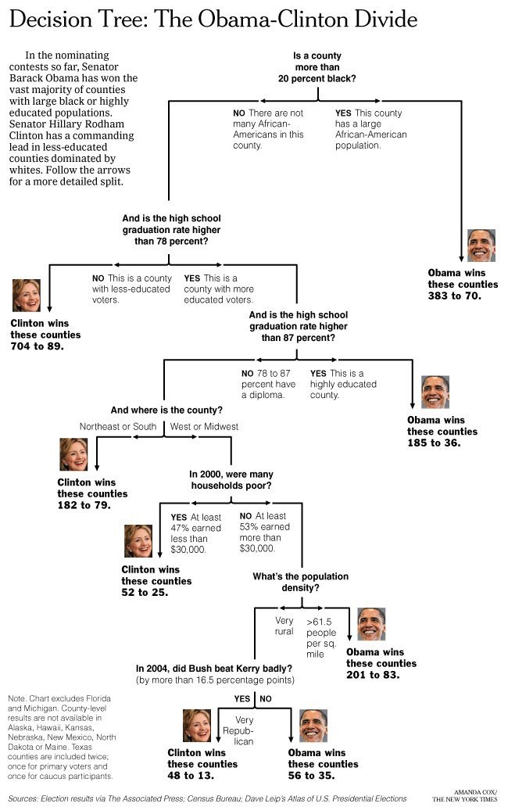

---
title: "Intro"
output:
  xaringan::moon_reader:
    lib_dir: libs
    nature:
      highlightStyle: github
      highlightLines: true
      countIncrementalSlides: false
   

---

```{r setup, include=FALSE}
options(htmltools.dir.version = FALSE)
```

```{r xaringan-tile-view, echo=FALSE, warning=FALSE, message=FALSE}
xaringanExtra::use_tile_view()
```


```{r xaringan-panelset, echo=FALSE}
xaringanExtra::use_panelset()
```

```{r, echo=FALSE}
xaringanExtra::use_webcam()
```

```{r xaringan-fit-screen, echo=FALSE}
xaringanExtra::use_fit_screen()
```


---
#### Decision Boundary in Classification


Classification is a process of finding the **decision boundary** that best separate two classes

---
#### Decision Boundary in Classification


SVM = Support Vector Machine


---
#### Decision Tree

- Decision Tree for classification is **Classification Tree**
- Decision Tree for Regression is **Regression Tree**

---



[Link] (http://graphics8.nytimes.com/images/2008/04/16/us/0416-nat-subOBAMA.jpg| width=10)

---


---
#### Classification Tree


- In two dimension, classification Tree's decision boundary is a collection of horiontal and vertical line


---
#### Data


```{r, echo = FALSE, warning=FALSE, message=FALSE}
x1 = c(1:4,4)
x2 = c(1,2,1,0,1)
y = c(0,1,0,1,1)

d = data.frame(cbind(x1, x2, y))
library(ggplot2)
ggplot(d, aes(x=x1, y=x2, color = factor(y)))+geom_point(size =7)+ylim(0, 10)+
  theme_bw() +
  theme(axis.line = element_line(colour = "black"),
    panel.grid.major = element_blank(),
    panel.grid.minor = element_blank(),
    panel.border = element_blank(),
    panel.background = element_blank()) +
  theme(legend.position = "none")

```

- The tree starts by a vertical or horizontal line that **best** seperate the data
- **Question**: Find a vertical line that best seperate **red** and **green**. 

---
#### One way to seperate the reds and greens


```{r, echo = FALSE, warning=FALSE, message=FALSE}
x1 = c(1:4,4)
x2 = c(1,2,1,0,1)
y = c(0,1,0,1,1)

d = data.frame(cbind(x1, x2, y))
library(ggplot2)
ggplot(d, aes(x=x1, y=x2, color = factor(y)))+geom_point(size = 7)+ylim(0, 10)+geom_vline(xintercept=3/2, linetype="dashed", color = "blue", size=1)+ geom_text(x=3/2, y=.8, label="Split 1", size = 10)+
  theme_bw() +
  theme(axis.line = element_line(colour = "black"),
    panel.grid.major = element_blank(),
    panel.grid.minor = element_blank(),
    panel.border = element_blank(),
    panel.background = element_blank()) +
  theme(legend.position = "none")

```


---
#### One way to seperate the reds and greens


```{r, echo = FALSE}
x1 = c(1:4,4)
x2 = c(1,2,1,0,1)
y = c(0,1,0,1,1)

d = data.frame(cbind(x1, x2, y))
library(ggplot2)
ggplot(d, aes(x=x1, y=x2, color = factor(y)))+geom_point(size = 7)+ylim(0, 10)+geom_vline(xintercept=5/2, linetype="dashed", color = "blue", size=1)+ geom_text(x=5/2, y=.8, label="Split 2", size=10)+
  theme_bw() +
  theme(axis.line = element_line(colour = "black"),
    panel.grid.major = element_blank(),
    panel.grid.minor = element_blank(),
    panel.border = element_blank(),
    panel.background = element_blank()) +
  theme(legend.position = "none")

```


---
#### One way to seperate the reds and greens


```{r, echo = FALSE}
x1 = c(1:4,4)
x2 = c(1,2,1,0,1)
y = c(0,1,0,1,1)

d = data.frame(cbind(x1, x2, y))
library(ggplot2)
ggplot(d, aes(x=x1, y=x2, color = factor(y)))+geom_point(size = 7)+ylim(0, 10)+geom_vline(xintercept=7/2, linetype="dashed", color = "blue", size=1)+ geom_text(x=7/2, y=.8, label="Split 3", size=10)+
  theme_bw() +
  theme(axis.line = element_line(colour = "black"),
    panel.grid.major = element_blank(),
    panel.grid.minor = element_blank(),
    panel.border = element_blank(),
    panel.background = element_blank()) +
  theme(legend.position = "none")

```


---
#### Question

- **Question**: Which is the best split? 

---
#### Partial Answer

- It looks like Split 1 and 3 are better than Split 2 since it misclassifies less
- Which is the better split between Split 1 and Split 3?
- We need to find a way to measure *how good a split is*


---
#### Impurity Measure

- The impurity of a node (__a node = a subset of the data or the original data__) measure how uncertain the node is.  
- For example, node A with 50% reds and 50% greens would be more uncertained than node B with 90% reds and 10% greens. Thus, node A has greater impurity than node B. 
- More uncertained $=$ Greater impurity

---
#### Impurity Measure

- A split that *gains* more impurity is the **better split**!

---
##### Impurity Gain


\begin{equation}
IG = I_{parent} - \frac{N_{left}}{N}I_{left}-\frac{N_{right}}{N}I_{right}
\end{equation}

- IG is Impurity Gain of the split
- $N_{left}$ and $N_{right}$ are the number of points in the left child node and right child node, respectively. 
- $N_{left}+N_{right}=N$

