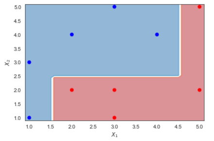

```{r global_options, include=FALSE}
knitr::opts_chunk$set(fig.width=12, fig.height=8, fig.path='Figs/',
                      echo=FALSE, warning=FALSE, message=FALSE)
```

Given the data.

<center>

| $x_1$ | $x_2$ | y  |
|:----:|:----:|:----:|
| 1  | 1  | 1  |
| 1  | 3  | 1  |
| 2  | 2  | -1 |
| 2  | 4  | 1  |
| 3  | 1  | -1 |
| 3  | 2  | -1 |
| 3  | 5  | 1  |
| 4  | 4  | 1  |
| 5  | 2  | -1 |
| 5  | 5  | -1 |
</center>

Suppose we use this data to train an Adaboost model with the learning rate $L=1$ and obtain the three stumps as follows.

  - Stump 1: $I(x_2>2.5)$. Where $I(\cdot)$ is an indicator function, taking value $1$ if $x_2>2.5$ and $-1$ otherwise. This means that this stump will predict $1$ for if $x_2>2.5$ and $-1$ otherwise. 
  
  - Stump 2: $I(x_1<1.5)$
  
  - Stump 3: $I(x_1<4.5)$

  a. Compute the weight of the data in the first round.
  
  b. After the first round, which observations should have the weights increased? Which observations should have the weights decreased? Explain why. 
  
  c. (With learning rate 1). Compute the voting powers of the three stumps. Which stump has the highest voting power? 
  
  d. Draw the decision boundary of the adaboost. 
  
  e. Compute the error (misclassification) of the adataboost, which is the final model after combining all the three stumps.

### Solution

a. In the first round, all observations have equal weights.  Since we have 10 observations, each will weight 1/10. The weights in the first round are in the `Weight 1`($w_1$) column as follows. 

|    |   x1 |   x2 |   y |  Weight 1 ($w_1$)  |
|:----:|:------:|:------:|:-----:|:------------:|
|  0 |    1 |    1 |   1 |        0.1 |
|  1 |    1 |    3 |   1 |        0.1 |
|  2 |    2 |    2 |  -1 |        0.1 |
|  3 |    2 |    4 |   1 |        0.1 |
|  4 |    3 |    1 |  -1 |        0.1 |
|  5 |    3 |    2 |  -1 |        0.1 |
|  6 |    3 |    5 |   1 |        0.1 |
|  7 |    4 |    4 |   1 |        0.1 |
|  8 |    5 |    2 |  -1 |        0.1 |
|  9 |    5 |    5 |  -1 |        0.1 |

b. We first generate the predictions of `Stump 1` after the first round. Notice that `Stump 1` said that if an observations has $x_2>2.5$, predicts 1. Otherwise, predicts -1. The predictions of the `Stump 1` are as follows.

|    |   x1 |   x2 |   y |   Stump 1 Predicts ($y_1$) |
|:----:|:------:|:------:|:-----:|:-----------:|
|  0 |    1 |    1 |   1 |        -1 |
|  1 |    1 |    3 |   1 |         1 |
|  2 |    2 |    2 |  -1 |        -1 |
|  3 |    2 |    4 |   1 |         1 |
|  4 |    3 |    1 |  -1 |        -1 |
|  5 |    3 |    2 |  -1 |        -1 |
|  6 |    3 |    5 |   1 |         1 |
|  7 |    4 |    4 |   1 |         1 |
|  8 |    5 |    2 |  -1 |        -1 |
|  9 |    5 |    5 |  -1 |         1 |

Adaboost will decrease the weights for correctly classified observations and increase the weights for misclassified observations. Thus, the weights get increased are of observations 0, 9. the weights get decreased are of the remainders. 

c. We first calculate the erros, $\epsilon_{1}$ and voting power, $\alpha_{1}$, for `Stump 1`. Since `Stump 1` has 2 misclassification at observations 0 and 9, the errors of `Stump 1` is the sum of the weights of observations 0 and 9.

So $\epsilon_{1}=.2$. And, 

$$
\alpha_{1} = L \cdot \frac{1}{2} \cdot \ln(\frac{1-\epsilon_{1}}{\epsilon_{1}}) = 0.693
$$

With the learning rate $L=1$, the weights are updated as follows. 

For misclassified observations 0, 9: 

$$
w_{new} =   w_{old} \cdot e^{\alpha} = 0.2   
$$

For the remaining observations:  

$$
w_{new} =  w_{old} \cdot e^{-\alpha} = .05
$$


Then, we need to normalize the weights so that they add up to 1. By dividing the weights by the total $(.2*2+.05*8 = .8)$, we have the weights for the second round are as follows (Weight 2). 

|    |   x1 |   x2 |   y |   Stump 1 Predicts ($y_1$)  |   Weight 1 ($w_1$) |   Weight 2 ($w_2$) |
|:----:|:------:|:------:|:-----:|:-----------:|:------------:|:------------:|
|  0 |    1 |    1 |   1 |        -1 |        0.1 |     0.25   |
|  1 |    1 |    3 |   1 |         1 |        0.1 |     0.0625 |
|  2 |    2 |    2 |  -1 |        -1 |        0.1 |     0.0625 |
|  3 |    2 |    4 |   1 |         1 |        0.1 |     0.0625 |
|  4 |    3 |    1 |  -1 |        -1 |        0.1 |     0.0625 |
|  5 |    3 |    2 |  -1 |        -1 |        0.1 |     0.0625 |
|  6 |    3 |    5 |   1 |         1 |        0.1 |     0.0625 |
|  7 |    4 |    4 |   1 |         1 |        0.1 |     0.0625 |
|  8 |    5 |    2 |  -1 |        -1 |        0.1 |     0.0625 |
|  9 |    5 |    5 |  -1 |         1 |        0.1 |     0.25   |

c. Following the same process, we have the following table

|    |   x1 |   x2 |   y |   Stump 1 Predicts ($y_1$) |   Weight 1 ($w_1$)|   Weight 2($w_2$)|   Stump 2 Predicts  ($y_2$)|   Weight 3 ($w_3$) |   Stump 3 Predicts ($y_3$) |
|:----:|:------:|:------:|:-----:|:-----------:|:------------:|:------------:|:-----------:|:------------:|:-----------:|
|  0 |    1 |    1 |   1 |        -1 |        0.1 |     0.25   |         1 |  0.153846  |         1 |
|  1 |    1 |    3 |   1 |         1 |        0.1 |     0.0625 |         1 |  0.0384615 |         1 |
|  2 |    2 |    2 |  -1 |        -1 |        0.1 |     0.0625 |        -1 |  0.0384615 |         1 |
|  3 |    2 |    4 |   1 |         1 |        0.1 |     0.0625 |        -1 |  0.166667  |         1 |
|  4 |    3 |    1 |  -1 |        -1 |        0.1 |     0.0625 |        -1 |  0.0384615 |         1 |
|  5 |    3 |    2 |  -1 |        -1 |        0.1 |     0.0625 |        -1 |  0.0384615 |         1 |
|  6 |    3 |    5 |   1 |         1 |        0.1 |     0.0625 |        -1 |  0.166667  |         1 |
|  7 |    4 |    4 |   1 |         1 |        0.1 |     0.0625 |        -1 |  0.166667  |         1 |
|  8 |    5 |    2 |  -1 |        -1 |        0.1 |     0.0625 |        -1 |  0.0384615 |        -1 |
|  9 |    5 |    5 |  -1 |         1 |        0.1 |     0.25   |        -1 |  0.153846  |        -1 |

The errors and voting power of `Stump 2` and `Stump 3` are as follows. 

$$
\epsilon_2 = 0.1875\\
\epsilon_3 = 0.115\\
\alpha_2 = 0.733\\
\alpha_3 = 1.018
$$

`Stump 3` has the highest voting power. 

d. The prediction function of the adaboost is

$$
H(x) = Sign \bigg( 0.693 \cdot I(x_2>2.5) + 0.733 \cdot I(x_1<1.5) + 1.018 \cdot I(x_1<4.5) \bigg)
$$

Where the $Sign$ function takes value $1$ if the argument of the function is positive and $-1$ otherwuse. The decision boundary is as follows. (Red points are negatives).  

- This video shows how to make decision boundary of the adaboost: [link](https://bryant.hosted.panopto.com/Panopto/Pages/Viewer.aspx?id=e0a751e8-d6c8-4a7d-98f7-adcc01064682)
  
- This note shows how to draw decision boundary of Adaboost can be found here: [Link](adaboost_db.pdf)

<center>

</center>

e. From the decision boundary we can see that the adaboost perfectly classifies the positives and the negatives. Thus, the error of the adaboost is 0. 