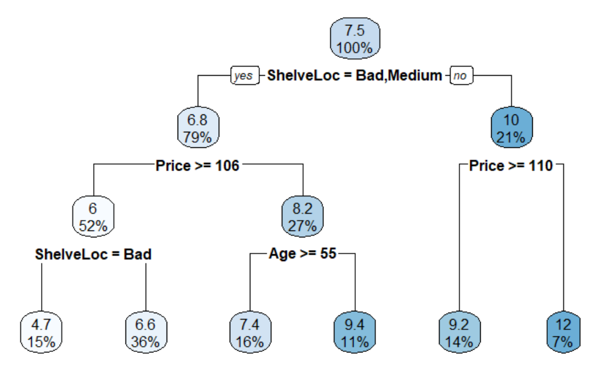
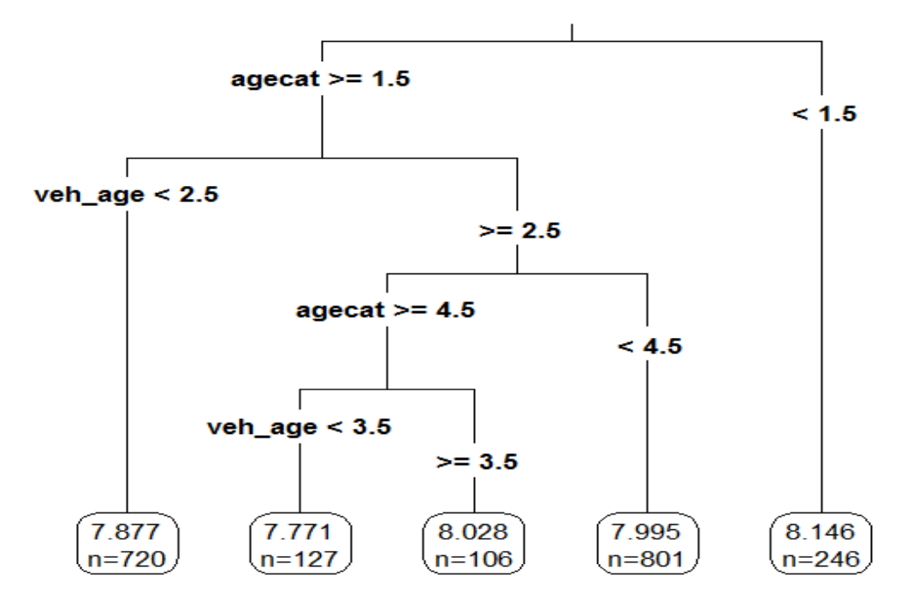
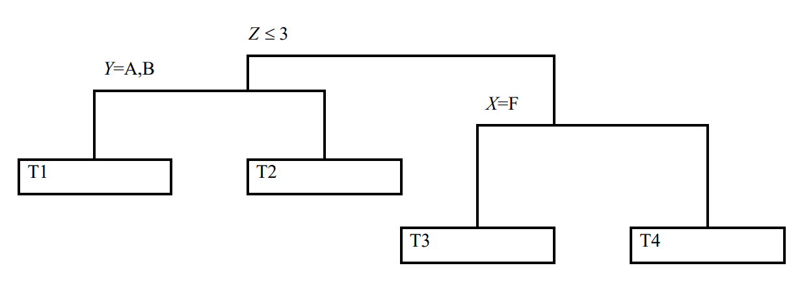
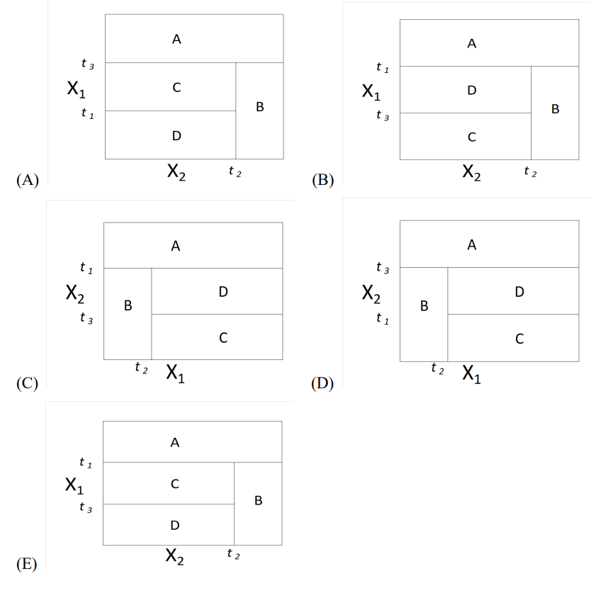

*Watch the videos to see how the similar problems are solve.*

### Making Prediction with trees

**Problem 1** (Sample - Question 63)

You have constructed the following regression tree predicting unit sales (in
thousands) of car seats. The variable ShelveLoc has possible values Good,
Medium, and Bad

| Variable    | Observed Value |
|:-------------|:----------------|
| ShelveLoc   | Good           |
| Price       | 120            |
| Age         | 57             |
| Advertising | 12             |

Determine the predicted unit sales (in thousands) for the above observation based on the
regression tree.

(A) 4.7
(B) 6.6
(C) 7.4
(D) 9.2
(E) 9.4

**Problem 2**

Consider the following regression tree to predict the log salary of a baseball player.

{width=50%}

The number in each node is the mean log salary in that node.  Calculate the predicted salary for a player who  has played 3 years and has 120 hits.

(A) 5.11
(B) 6
(C) 6.74
(D) 166
(E) 846

**Problem 3** (Sample - Question 33)
The regression tree shown below was produced from a dataset of auto claim
payments. Age Category (agecat: 1, 2, 3, 4, 5, 6) and Vehicle Age (veh_age: 1, 2,
3, 4) are both predictor variables, and log of claim amount (LCA) is the dependent
variable. 

Consider three autos I, II, III:

I: An Auto in Age Category 1 and Vehicle Age 4

II: An Auto in Age Category 5 and Vehicle Age 5

III: An Auto in Age Category 5 and Vehicle Age 3

Rank the estimated LCA of Autos I, II, and III.

(A) LCA(I) < LCA(II) < LCA(III)
(B) LCA(I) < LCA(III) < LCA(II)
(C) LCA(II) < LCA(I) < LCA(III)
(D) LCA(II) < LCA(III) < LCA(I)
(E) LCA(III) < LCA(II) < LCA(I)

**Problem 4** (Sample - Question 57)

You are given:

i) The following observed values of the response variable, R, and predictor
variables X, Y, Z:

| R | 4.75 | 4.67 | 4.67 | 4.56 | 4.53 | 3.91 | 3.90 | 3.90 | 3.89 |
|:---|:------|:------|:------|:------|:------|:------|:------|:------|:------|
| X | M    | F    | M    | F    | M    | F    | F    | M    | M    |
| Y | A    | A    | D    | D    | B    | C    | B    | D    | B    |
| Z | 2    | 4    | 1    | 3    | 2    | 2    | 5    | 5    | 1    |

ii) The following plot of the corresponding regression tree:

Calculate the Mean Response (MR) for each of the end nodes.

(A) MR(T1) = 4.39, MR(T2) = 4.38, MR(T3) = 4.29, MR(T4) = 3.90
(B) MR(T1) = 4.26, MR(T2) = 4.38, MR(T3) = 4.62, MR(T4) = 3.90
(C) MR(T1) = 4.26, MR(T2) = 4.39, MR(T3) = 3.90, MR(T4) = 4.29
(D) MR(T1) = 4.64, MR(T2) = 4.29, MR(T3) = 4.38, MR(T4) = 3.90
(E) MR(T1) = 4.64, MR(T2) = 4.38, MR(T3) = 4.39, MR(T4) = 3.90

**Problem 5** (Sample - Question 51)

You are given the following regression tree predicting the weight of ducks in
kilograms (kg):

You predict the weight of the following three ducks:

X: Wing Span = 5.5 cm, Male, Age = 7 years

Y: Wing Span = 5.8 cm, Female, Age = 5 years

Z: Wing Span = 5.7 cm, Male, Age = 8 years

Determine the order of the predicted weights of the three ducks.

(A) X < Y < Z
(B) X < Z < Y
(C) Y < X < Z
(D) Y < Z < X
(E) Z < X < Y

### Growing a tree

**Problem 6** (Sample - Question 9)

A classification tree is being constructed to predict if an insurance policy will
lapse. A random sample of 100 policies contains 30 that lapsed. You are
considering two splits:

- Split 1: One node has 20 observations with 12 lapses and one node has 80
observations with 18 lapses.
- Split 2: One node has 10 observations with 8 lapses and one node has 90
observations with 22 lapses.

The total Gini index after a split is the weighted average of the Gini index at each node,
with the weights proportional to the number of observations in each node.

The total entropy after a split is the weighted average of the entropy at each node, with
the weights proportional to the number of observations in each node.

Determine which of the following statements is/are true?

- (I). Split 1 is preferred based on the total Gini index.

- (II). Split 1 is preferred based on the total entropy.

- (III). Split 1 is preferred based on having fewer classification errors.

(A) I only
(B) II only
(C) III only
(D) I, II, and III
(E) The correct answer is not given by (A), (B), (C), or (D)

### Others

**Problem 7** (Sample - Question 26)

Each picture below represents a two-dimensional space where observations are
classified into two categories. The categories are representing by light and dark
shading. A classification tree is to be constructed for each space.

Determine which space can be modeled with no error by a classification tree.

(A) I only
(B) II only
(C) III only
(D) I, II, and III
(E) The correct answer is not given by (A), (B), (C), or (D).

**Problem 8** (Sample - Question 29)

Determine which of the following considerations may make decision trees
preferable to other statistical learning methods.

I. Decision trees are easily interpretable.

II. Decision trees can be displayed graphically.

III. Decision trees are easier to explain than linear regression methods.

(A) None
(B) I and II only
(C) I and III only
(D) II and III only
(E) The correct answer is not given by (A), (B), (C), or (D).

**Problem 9** (Sample - Question 48)
The following tree was constructed using recursive binary splitting with the left
branch indicating that the inequality is true.

Determine which of the following plots represents this tree. 

