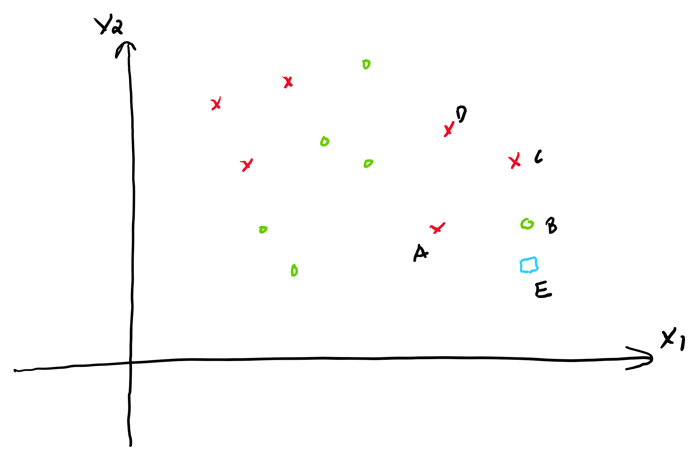

Instruction: Following the sample problems and solution below to do this assignment. 

[Sample Problems and Solutions](ayu7_sample.html)

### Problem 1.

Given the data.

|     | Age | Sex | Survived |
|:----|:----|:----|:---------|
| A   | 27  | M   | 0        |
| B   | 30  | F   | 1        |
| C   | 80  | F   | 1        |
| D   | 50  | M   | 0        |
| E   | 60  | F   | 0        |
| F   | 70  | F   | 1        |

a.  Let G be a female of 55 years old. Use 1NN to predict whether G is survived (`Survived =1`) or not (`Survived = 0`). Does the prediction change if used 3NN?

b.  Given the following data, use 1NN and 3NN to predict the salary for G (a female of 55 years old).

|     | Age | Sex | Salary (k) |
|:----|:----|:----|:-----------|
| A   | 27  | M   | 80         |
| B   | 30  | F   | 70         |
| C   | 80  | F   | 90         |
| D   | 50  | M   | 60         |
| E   | 60  | F   | 10         |
| F   | 70  | F   | 100        |

### Problem 2.

Given the data. Consider $x$ as 1 and $o$ as 0.

With EB = 1.4, EA = 3, EC = 3, ED = 4,

a.  Use the **uniform weights** to calculate the predicted probability and the prediction of **3NN** for E.

b.  Use the **distance weights** to calculate the predicted probability and the prediction of **3NN** for E.

c.  Use the **distance weights** to calculate the predicted probability and the prediction of **4NN** for E.

### Problem 3 - KNN for Recommendation System (Optional)

This problem is optional. Complete this problem correctly will give you 50% point extra credits for this AYU.

We can use KNN to build a recommendation system to recommend items to users. For more about using KNN for Recommendation System, please click to the below link.

[KNN for Recommendation System](ayu_7_rs.html)

Given the utility matrix

|        | Item 1 | Item 2 | Item 3 | Item 4 | Item 5 |
|:-------|:-------|:-------|:-------|:-------|:-------|
| Alice  | 5      | 3      | 3      | 4      |        |
| User 1 | 3      | 1      | 2      | 3      | 3      |
| User 2 | 2      | 3      | 4      | 3      | 5      |
| User 3 | 3      | 3      | 1      | 4      | 4      |
| User 4 | 1      | 5      | 5      | 4      | 2      |

Should we recommend Item 5 to Alice? Calculate her estimated rating on Item 5 to answer the question. Recommend the item if Alice's rating is 4 or above.

a.  Use user-based KNN, with $k=2$ and Manhantan distance.

b.  Use item-based KNN, with $k=3$ and cosine similarity.

------------------------------------------------------------------------

