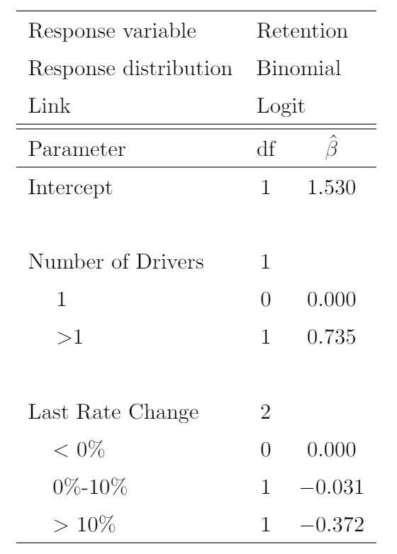
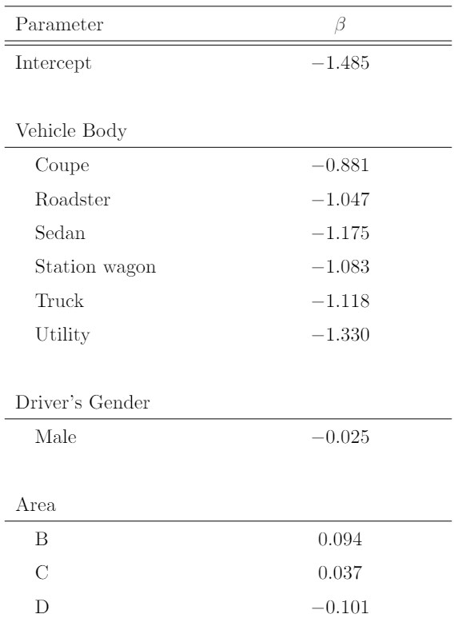
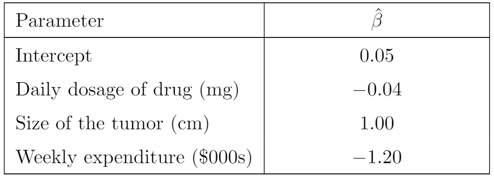
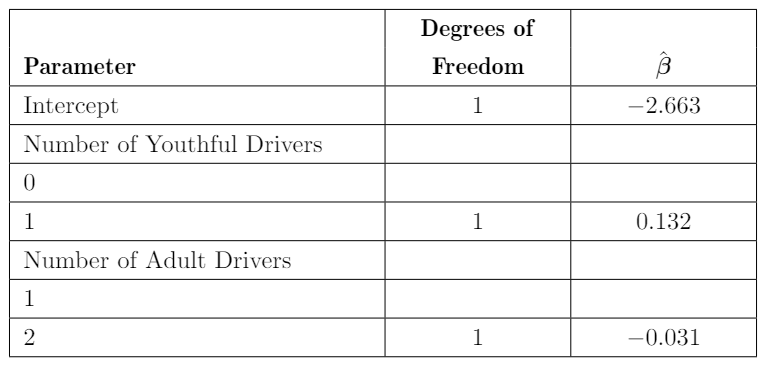
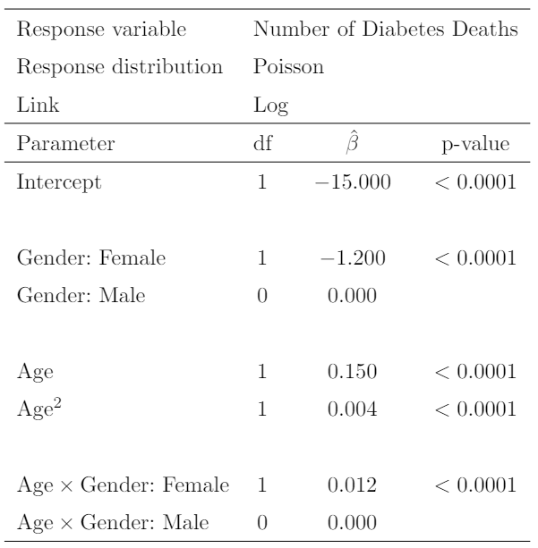
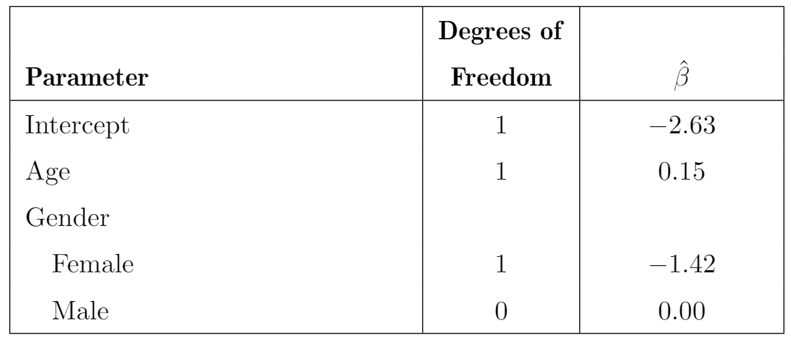
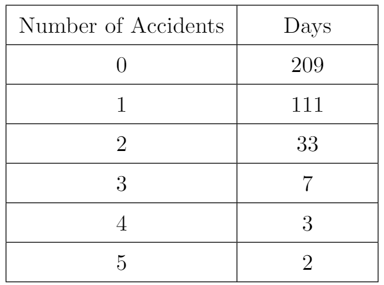
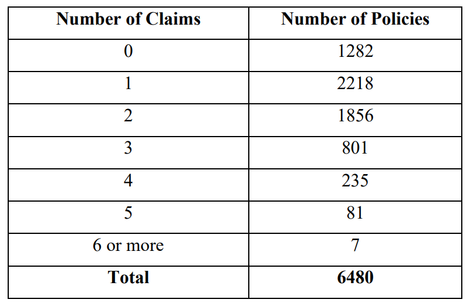
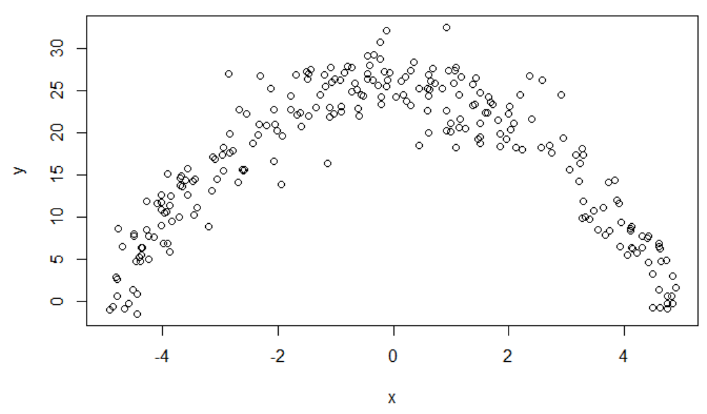
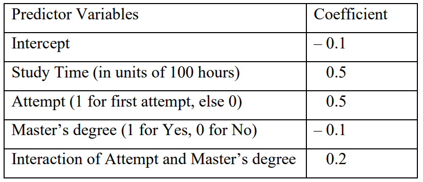

```{r setup, include=FALSE}
knitr::opts_chunk$set(echo = TRUE)
```

---

### Type 1: Logistic Regression

**Problem 1**

A statistician uses logistic regression to model a probability of success of a random variable. You are given

- There is one predictors and an intercept in the model

- The estimates of success at $x = 1$ and $x = 2$ are 0.2 and 0.3, respectively. 

Calculate $\hat{\beta}_1$ the estimated slope of the model.

**Problem 2**

You are given the following information for a GLM of customer retention

{width=35%}

Calculate the probability of retention for a policy with 3 drivers and a prior rate changes of 5%.

(A) Less than 0.85
(B) At least 0.85, but less than 0.87
(C) At least 0.87, but less than 0.89
(D) At least 0.89, but less than 0.91
(E) At least 0.91

**Problem 3**

You are given the following information for a GLM to estimate the probability of claim. Distribution selected is Binomial (Bernoulli) and the link function is logit. 

{width=45%}

Calculate the estimated probability of claim for 

- Driver Gender: Female
- Vehicle Body: Sedan
- Area: D

(A) Less than 0.045
(B) At least 0.045, but less than 0.050
(C) At least 0.050, but less than 0.055
(D) At least 0.055, but less than 0.060
(E) At least 0.060

**Problem 4**

You are given the following output from a logistic regression to estimate the probability of death cancer patients. 

{width=55%}

Calculate the estimated probability of death for a patient who has a tumor of 2cm, spends $780 on medical treatment and 10mg of drug is injected everyday. 

(A) Less than 0.5
(B) At least 0.5, but less than 0.6
(C) At least 0.6, but less than 0.7
(D) At least 0.7, but less than 0.8
(E) At least 0.8

### Type 2: Poisson Regression

**Problem 5**

You are given the following for a model of vehicle claim counts by policy

- The response distribution is Poisson and the link function is a log link function

- The parameters are given as follows. 

{width=70%}

Calculate the predicted claim count for a policy with one adult driver and one youthful driver. 

(A) Less than 0.072
(B) At least 0.072, but less than 0.074
(C) At least 0.074, but less than 0.076
(D) At least 0.076, but less than 0.078
(E) At least 0.078


**Problem 6**

You are given the follow. 

{width=50%}

Calculate the predicted number deaths for a population of 100,000 females age 25

(A) Less than 3
(B) At least 3, but less than 5
(C) At least 5, but less than 7
(D) At least 7, but less than 9
(E) At least 9


**Problem 7**

You are given the follow result of a Poisson Regression where the response is the total number of claims for a risk group. Calculate the estimated total number of claims for a risk group consisting of 2,000 female aged 25. 

{width=50%}

(A) Less than 1,500
(B) At least 1,500, but less than 1,600
(C) At least 1,600, but less than 1,700
(D) At least 1,700, but less than 1,800
(E) At least 1,800

<!--

**Problem 8**

You use a chi-square test to measure the fit of a Poisson distribution with mean 0.6.  The minimum expected number of observations in any group should be 5. The maximum number of groups should be used. 

Determine the chi-square statistics. 

{width=50%}

(A) 1
(B) 3
(C) 10
(D) 13
(E) 32

-->

**Problem 8** (SRM - Sample Question 11)

Determine which of the following pairs of distribution and link function is the most appropriate to model if a person is hospitalized or not.

(A) Normal distribution, identity link function
(B) Normal distribution, logit link function
(C) Binomial distribution, linear link function
(D) Binomial distribution, logit link function
(E) It cannot be determined from the information given. 


<!-- 

**Problem.** (SRM - Sample Question 14) Variable Transformation

From an investigation of the residuals of fitting a linear regression by ordinary
least squares it is clear that the spread of the residuals increases as the predicted
values increase. Observed values of the dependent variable range from 0 to 100.
Determine which of the following statements is/are true with regard to transforming the
dependent variable to make the variance of the residuals more constant.

I. Taking the logarithm of one plus the value of the dependent variable may
make the variance of the residuals more constant.\
II. A square root transformation may make the variance of the residuals more
constant.\
III. A logit transformation may make the variance of the residuals more
constant.

(A) None
(B) I and II only
(C) I and III only
(D) II and III only
(E) The correct answer is not given by (A), (B), (C), or (D).


**Problem.** (SRM - Sample Question 20)

An analyst is modeling the probability of a certain phenomenon occurring. The
analyst has observed that the simple linear model currently in use results in
predicted values less than zero and greater than one.

Determine which of the following is the most appropriate way to address this issue.

(A) Limit the data to observations that are expected to result in predicted values
between 0 and 1.
(B) Consider predicted values below 0 as 0 and values above 1 as 1.
(C) Use a logit function to transform the linear model into only predicting values
between 0 and 1.
(D) Use the logarithm link function for the Poisson distribution to transform the linear
model into only predicting values between 0 and 1.
(E) None of the above.

-->


<!-- 

**Problem.** (SRM - Sample Question 28)

Dental claims experience was collected on 6480 policies. There were a total of
9720 claims on these policies. The following table shows the number of dental
policies having varying numbers of claims.



Calculate the chi-squared statistic to test if a Poisson model (Poisson Distribution) with no predictors provides
an adequate fit to the data.

(A) 80
(B) 83
(C) 86
(D) 89
(E) 92


**Problem.** (SRM - Sample Question 39)

You are given a dataset with two variables, which is graphed below. You want to
predict $y$ using $x$. Determine which statement regarding using a generalized linear model (GLM) or a
random forest is true.



(A) A random forest is appropriate because the dataset contains only quantitative
variables.
(B) A random forest is appropriate because the data does not follow a straight line.
(C) A GLM is not appropriate because the variance of y given x is not constant.
(D) A random forest is appropriate because there is a clear relationship between $y$ and $x$.
(E) A GLM is appropriate because it can accommodate polynomial relationships.


**Problem.** (SRM - Sample Question 42)

Determine which of the following statements is NOT true about the linear
probability, logistic, and probit regression models for binary dependent variables.

(A) The three major drawbacks of the linear probability model are poor fitted values,
heteroscedasticity, and meaningless residual analysis.
(B) The logistic and probit regression models aim to circumvent the drawbacks of
linear probability models.
(C) The logit function is given by $\pi(z) =\frac{e^z}{1+e^z}$
(D) The probit function is given by $\pi(z) = \phi(z)$  where $\phi$ is the standard normal
distribution function.
(E) The logit and probit functions are substantially different. 

-->

**Problem 9** (SRM - Sample Question 45)

The actuarial student committee of a large firm has collected data on exam scores.
A generalized linear model where the target is the exam score on a 0-10 scale is
constructed using a log link, resulting in the following estimated coefficients

{width=70%}

The company is about to offer a job to an applicant who has a Master’s degree and for
whom the exam would be a first attempt. It would like to offer half of the study time that
will result in an expected exam score of 6.0.

Calculate the amount of study time that the company should offer.

(A) 123 hours
(B) 126 hours
(C) 129 hours
(D) 132 hours
(E) 135 hours

**Problem 10**

You are given the following output of an GLM. 

{width=50%}

Calculate the predicted claim size for an observation from Zone 3 with driver Class Truck and Driver Age Old.

(A) Less than 650
(B) At least 650, but less than 700
(C) At least 700, but less than 750
(D) At least 750, but less than 800
(E) At least 800


**Problem 11**

You are given the following output of an GLM. 

{width=50%}

Calculate the probability of a policy with 4 years of tenure that experienced at a 12% prior rate increase and has 225,000 in amount of insurance will retain into the next policy term.

(A) Less than 0.6
(B) At least 0.6, but less than 0.7
(C) At least 0.7, but less than 0.8
(D) At least 0.8, but less than 0.9
(E) At least 0.9