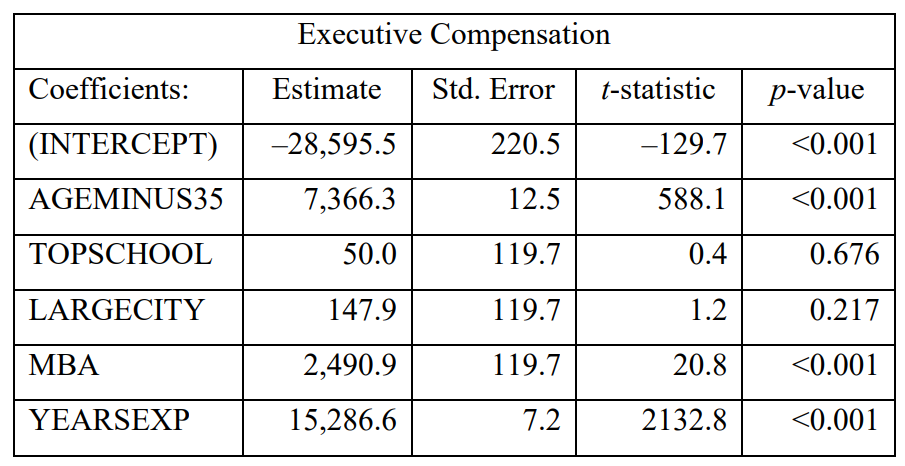

```{r setup, include=FALSE}
knitr::opts_chunk$set(echo = TRUE)
```

### Type 1: Parameter Estimators

**Problem 1** (Course 120 Study Note 120-82-94 Question 11)

An automobile insurance company wants to use gender ($x_1 = 0$, if female and $x_1 = 1, if male$) and traffic penalty point ($x)2$) to predict the number of claims ($y$).  The observed values of these variables for a sample of six motorists are given by:

| Motorist | 1 | 2 | 3 | 4 | 5 | 6 |
|:----------|:---|:---|:---|:---|:---|:---|
| $x_1$    | 0 | 0 | 0 | 1 | 1 | 1 |
| $x_2$    | 0 | 1 | 2 | 0 | 1 | 2 |
| $y$      | 1 | 0 | 2 | 1 | 3 | 5 |

You are using the following model:

$$
y_i = \beta_0 + \beta_1 x_{i1} + \beta_2 x_{i2} + \epsilon_i, \quad i = 1, 2,..., 6
$$
You have determine 

$$
(X'X)^{-1} = \frac{1}{12} \begin{bmatrix}
7 & -4 & -3\\
-4 & 8 & 0 \\
-3 & 0 & 3
\end{bmatrix}
$$

Determine $\hat{\beta_2}$.

(A) -0.25
(B) 0.25
(C) 1.25
(D) 2.00
(E) 4.25

**Problem 2** (Course 120 Study Note 120-10-90 Question 19)

You are performing a multiple regression of the form:

$$
y_i = \beta_0 + \beta_1 x_{i1} + \beta_2 x_{i2} + \epsilon_i
$$
You have obtain the following data

| $y$ | $x_1$ | $x_2$ |
|:-----|:-------|:-------|
| 1   | -1    | -1    |
| 2   | 1     | -1    |
| 3   | -1    | 1     |
| 4   | 1     | 1     |

Determine $\hat{\beta_0}+\hat{\beta_1}+\hat{\beta_2}$

(A) 3.5
(B) 4.0 
(C) 4.5
(D) 5.0
(E) 5.5


### Type 2: Inference (Testing, prediction intervals...)

#### F-test, and reduced models

**Problem 3** (CAS Exam ST Spring 2016 Question 22)

The following two models were fit to 18 observations:

Model 1: $y = \beta_0 + \beta_1 x_1 + \beta_2 x_2 + \epsilon$ \
Model 2: $y = \beta_0 + \beta_1 x_1 + \beta_2 x_2 + \beta_3 x_1x_2 +\beta_4 x_1^2 +\beta_5 x_2^2 + \epsilon$

The result of the regression are:

| Model Number | Error Sum of Squares | Regression Sum of Squares |
|:--------------|:----------------------|:---------------------------|
| 1            | 102                  | 23                        |
| 2            | 78                   | 47                        |

Calculate the value of the F-statistics used to test the hypothesis that $\beta_3 = \beta_4 =\beta_5 = 0$

(A) Less than 1.30
(B) At least 1.30, but less than 1.40
(C) At least 1.40, but less than 1.50
(D) At least 1.50, but less than 1.60
(E) At least 1.60

**Problem 4** (SOA Course)

A professor ran an experiment in three sections of a psychology courses to show that the more digits in a number, the more difficult it is to remember. The following variables were used in a multiple regression:

$x_1 = $ number of digits in the number
$x_2 = 1$ if student was in section 1, 0 otherwise
$x_3 = 1$ if student was in section 2, 0 otherwise
$y = $ percentage of students correctly remembering the number

You are given

- A total of 42 students participated in the study
- The regression equation $$y = \beta_0 + \beta_1 x_1 + \beta_2 x_1^2 + \beta_3 x_2 +\beta_4 x_3 + \epsilon$$ was to fit the data and resulted in $R^2 = 0.940$
- A second regression equation $y = \gamma_0 + \gamma_1 x_1 + \gamma_2 x_1^2+\epsilon$ was to fit to the data and resulted $R^2 = 0.915$

Determine the F statistic used to test whether class section is significant variable. 


(A) 5.4
(B) 7.3
(C) 7.7
(D) 7.9
(E) 8.3


**Problem 5** (SOA Course)

You are determining the relationship of salary ($y$) to experience ($x_1$) for both men ($x_2 = 1$) and woman ($x2=0$). You fit the model

$$y = \beta_0 + \beta_1 x_1 + \beta_2 x_2 + \beta_3 x_1x_2 + \epsilon$$
You are given

| Sources    | Sum of Squares | Degree of Freedom |
|:------------|:----------------|:-------------------|
| Regression | 330.0117       | 3                 |
| Error      | 12.8156        | 7                 |

You also fit the below model to the same observations. 

$$y = \gamma_0 + \gamma_1 x_1 +  \epsilon$$
You are given

| Sources    | Sum of Squares | Degree of Freedom |
|:------------|:----------------|:-------------------|
| Regression | 315.0992       | 1                 |
| Error      | 27.7281        | 9                 |

Determine the F-ratio to test whether the linear rellationship between salary and experience is identical for men and women. 

(A) 0.6
(B) 2.0
(C) 3.5
(D) 4.1
(E) 6.2


**Problem 6** (SRM - Sample Question 19)

The regression model $Y = \beta_0 + \beta_1 X_1 + \beta_2 X_2 + \beta_3 X_1 X_2 + \epsilon$ is being investigated.
The following maximized log-likelihoods are obtained:

- Using only the intercept term: –1126.91
- Using only the intercept term, $X_1$, and $X_2$ : –1122.41
- Using all four terms: –1121.91

The null hypothesis $H_0 : \beta_1 = \beta_2 = \beta_3 = 0$ is being tested at the 5% significance level
using the likelihood ratio test.

Determine which of the following is true.

(A) The test statistic is equal to 1 and the hypothesis cannot be rejected.
(B) The test statistic is equal to 9 and the hypothesis cannot be rejected
(C) The test statistic is equal to 10 and the hypothesis cannot be rejected.
(D) The test statistic is equal to 9 and the hypothesis should be rejected.
(E) The test statistic is equal to 10 and the hypothesis should be rejected. 


**Problem 7** (SRM - Sample Question 24)

Sarah performs a regression of the return on a mutual fund ($y$) on four predictors
plus an intercept. She uses monthly returns over 105 months.
Her software calculates the $F$ statistic for the regression as $F = 20.0$, but then it quits
working before it calculates the value of $R^2$. While she waits on hold with the help desk,
she tries to calculate $R^2$ from the F-statistic.

Determine which of the following statements about the attempted calculation is true.

(A) There is insufficient information, but it could be calculated if she had the value of
the residual sum of squares (RSS).
(B) There is insufficient information, but it could be calculated if she had the value of
the total sum of squares (TSS) and RSS.
(C) $R^2 = 0.44$
(D) $R^2 = 0.56$
(E) $R^2 = 0.80$

**Problem 8** (SRM - Sample Question 27)

Trevor is modeling monthly incurred dental claims. Trevor has 48 monthly claims
observations and three potential predictors:
- Number of weekdays in the month
- Number of weekend days in the month
- Average number of insured members during the month

Trevor obtained the following results from a linear regression:


|            | Coefficient    | Standard Error | Stat  | p-value |
|:------------|:----------------|:----------------|:-------|:---------|
| Intercept  | –45,765,767.76 | 20,441,816.55  | –2.24 | 0.0303  |
| Number of weekdays  | 513,280.76     | 233,143.23     | 2.20  | 0.0330  |
| Number of weekend days     |  280,148.46            | 483,001.55     | 0.58  | 0.5649  |
| Average number of members           | 38.64           | 6.42           | 6.01  | 0.0000  |

Determine which of the following variables should be dropped, using a 5% significance level.

I. Intercept \
II. Number of weekdays \
III. Number of weekend days \
IV. Number of members.

(A) I only
(B) II only
(C) III only
(D) IV only
(E) None should be dropped from the model


**Problem 9** (SRM - Sample Question 45)

Trish runs a regression on a data set of n observations. She then calculates a 95%
confidence interval $(t,u)$ on y for a given set of predictors. She also calculates a
95% prediction interval $(v, w)$  on y for the same set of predictors.
Determine which of the following must be true. 

I. $lim_{n \to \infty}(u-t)$ \
II. $lim_{n \to \infty}(w-v)$ \
III. $w-v > u-t$ 


(A) None
(B) I and II only
(C) I and III only
(D) II and III only
(E) The correct answer is not given by (A), (B), (C), or (D). 


### Type 3: Using MLM Models

**Problem 10** (SRM - Sample Question 49)

The actuarial student committee of a large firm has collected data on exam scores.
A generalized linear model where the target is the exam score on a 0-10 scale is
constructed using a log link, resulting in the following estimated coefficients

| Predictor Variables                        | Coefficient |
|:--------------------------------------------|:-------------|
| Intercept                                  | -0.1        |
| Study Time (in units of 100 hours)         | 0.5         |
| Attempt (1 for first attempt, else 0)      | 0.5         |
| Master’s degree (1 for Yes, 0 for No)      | –0.1       |
| Interaction of Attempt and Master’s degree | 0.2         |


The company is about to offer a job to an applicant who has a Master’s degree and for
whom the exam would be a first attempt. It would like to offer half of the study time that
will result in an expected exam score of 6.0.
Calculate the amount of study time that the company should offer.
(A) 123 hours
(B) 126 hours
(C) 129 hours
(D) 132 hours
(E) 135 hours

### Type 4: Collinearity

**Problem 11** (CAS Exam)

You are given the following information related to the following model

$y \sim x_1 + x_2 +x_3$ ($y$ is linearly regressed on $x_1, x_2, x_3$)

- $x_1 \sim x_2 + x_3$

| Sources    | Degree of Freedom  | Sum of Squares|
|:------------|:----------------|:-------------------|
| Regression | 2       |    3.73              |
| Error      | 503        | 3.04                 |

- $x_2 \sim x_1 + x_3$

| Sources    | Degree of Freedom  | Sum of Squares|
|:------------|:----------------|:-------------------|
| Regression | 2       |    24.74              |
| Error      | 503        | 226.34                 |

- $x_3 \sim x_1 + x_2$

| Sources    | Degree of Freedom  | Sum of Squares|
|:------------|:----------------|:-------------------|
| Regression | 2       |    214,258              |
| Error      | 503        | 85,883                |

Calculate the variance inflation factor (VIF) for the variable which exhibits the greatest collinearity in the original model. 

(A) Less than 1.0
(B) At least 1.0, but less than 2.0
(C) At least 2.0, but less than 3.0
(D) At least 3.0, but less than 4.0
(E) At least 4.0

**Problem 12** (CAS Exam)

A least squares regression is fit to a dataset.  The results are as follows. 

|                | Fitted | Standard Error |
|:----------------|:--------|:----------------|
| $\hat{\beta_0}$ | 1.00   | 0.05           |
| $\hat{\beta_1}$ | 2.50   | 0.15           |
| $\hat{\beta_2}$ | -0.50  | 0.20           |
| $\hat{\beta_3}$ | 2.00   | 0.80           |

A second model is fit to the same data using only the third independent variable. 

|                | Fitted | Standard Error |
|----------------|--------|----------------|
| $\hat{\beta_0}$ | 1.25   | 0.08           |
| $\hat{\beta_3}$ | 2.20   | 0.75           |

Calculate the VIF of $x_3$. 

(A) Less than 1.0
(B) At least 1.0, but less than 1.05
(C) At least 1.05, but less than 1.10
(D) At least 1.10, but less than 1.15
(E) At least 1.15


### Type 5: Variable selection, AIC, BIC

**Problem 13** (SRM - Sample Question 54)
For a regression model of executive compensation, you are given:

i) The following statistics:



ii) The acceptable significance level is $\alpha = 0.10$. 

Determine which variable or variables should be removed first prior to rerunning the
model.

(A) (INTERCEPT)
(B) AGEMINUS35, MBA, and YEARSEXP
(C) TOPSCHOOL
(D) TOPSCHOOL and LARGECITY
(E) YEARSEXP


**Problem 14** (SRM - Sample Question 61)

A linear model has been fit to a dataset containing six predictor variables, F, G, H,
I, J, and K. Determine which of the following statements regarding using Akaike
information criterion (AIC) or Bayesian information criterion (BIC) to select an
optimal set of predictor variables for this linear model is/are true.

I. AIC and BIC provide a direct estimate of the test error. \
II. When choosing between the subsets {F, G, H} and {I, J, K}, AIC and BIC will
always select the same subset. \
III. For large sample sizes (n > 7), the number of variables selected by BIC will be
less than or equal to the number selected by AIC.

(A) None
(B) I and II only
(C) I and III only
(D) II and III only
(E) The correct answer is not given by (A), (B), (C), or (D).

**Problem 15** (SOA Course Note)
You apply all possible regression model to a set of five observations with three explanatory variables.  You have the follows. 

| Model | Variables | RSS   |
|:-------|:-----------|:-------|
| I     | None      | 10.24 |
| II    | $x_1$     | 5.85  |
| III   | $x_2$           | 8.45  |
| IV    | $x_3$           | 6.15  |
| V     |  $x_1, x_2$          | 5.12  |
| VI    | $x_1, x_3$           | 4.35  |
| VII   |       $x_2, x_3$     | 1.72  |
| VIII  |       $x_1, x_2, x_3$     | 1.07  |

Using Adjusted $R^2$ determine the best model. 

(A) Model I
(B) Model II
(C) Model IV
(D) Model VII
(E) Model VIII
