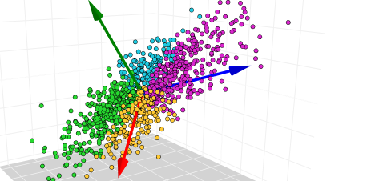

---
title: "Week 9 - AYUPod - Principal Component Analysis"
output:
  html_document:
    toc: yes
    toc_float: yes
    theme: united
  word_document:
    toc: yes
  pdf_document:
    toc: yes
---

---

```{r setup, include=FALSE}
knitr::opts_chunk$set(echo = TRUE, warning = FALSE, message = FALSE)
```



(Image: towardsdatascience)

Principal components analysis transforms the original data to a new data containing the  principal components (PCs). Each PC is a linear combination the original columns (A linear a combination of $x$ and $y$ is a number times $x$ adding to a number times $y$, for example $2x+3y$). PCs has the following nice property

- PCs are linear independent.  This means there will be no multilinearity when regression on the PCs. 

```{r}
library(factoextra)
library(tidyverse)  # data manipulation and visualization
library(gridExtra)
data("USArrests")

df = USArrests
# The variable Species (index = 5) is removed
# before the PCA analysis
res.pca <- prcomp(df,  scale = TRUE)

# Default plot
fviz_eig(res.pca, addlabels = TRUE)
get_eig(res.pca)
```

We can see that the first two PCs captures about 86% variance of the original data. If we want to reduce the dimension of the original data from 4 to 2, we can just use this two PCs instead of the entire original data.  To put it in perspective, each variable in the original data set (after scaling) captures the same amount of the total variance, so each captures 25% the total variance. 

We can see the contribution of the original variables in the first two PCs. 

```{r}
# Contributions of variables to PC1
fviz_contrib(res.pca, choice = "var", axes = 1, top = 10)
# Contributions of variables to PC2
fviz_contrib(res.pca, choice = "var", axes = 2, top = 10)

```

```{r}
library(ggfortify)
autoplot(res.pca)
```

### Question

Run the PCA for the `YieldCurve` data

- Plot the scree plot of the percentage of the total variances captured in the PCs. 

- How much variance is captured by the first two PCs? by the first PC?

- What are the contribution of the original variables in the first PC?

```{r, eval=FALSE, echo=FALSE}
library(YieldCurve)
data(FedYieldCurve)

df <- as.matrix(FedYieldCurve)

res.pca = prcomp(df,  scale = TRUE)

fviz_eig(res.pca, addlabels = TRUE)
# Contributions of variables to PC2
fviz_contrib(res.pca, choice = "var", axes = 1, top = 10)
fviz_contrib(res.pca, choice = "var", axes = 2, top = 10)
```


```{r, eval=FALSE, echo=FALSE}
library(ggfortify)
autoplot(res.pca)
```

```{r, eval=FALSE, echo=FALSE}
# plot arrangement
data("USArrests")
results <- prcomp(USArrests, scale = TRUE)
results$rotation <- -results$rotation
results$rotation
```


## For Modeling

```{r, eval=FALSE, echo=FALSE}

data("USArrests")

df = as_tibble(USArrests)

df <- df %>% rename(target=class)

df <- df %>% 
  mutate(target = as.factor(target))


library(caret)
set.seed(2020)
splitIndex <- createDataPartition(df$target, p = .70, 
                                  list = FALSE)
df_train <- df[ splitIndex,]
df_test <- df[-splitIndex,]

library(rpart) #load the rpart package
# Create a tree
tree_model <- rpart(target ~ ., data = df_train,
                 control = rpart.control(maxdepth = 3))
library(rattle)
fancyRpartPlot(tree_model)

tree_model$variable.importance
barplot(tree_model$variable.importance)
pred <- predict(tree_model, df_test, type = "class")
#Evaluate the predictions
cm <- confusionMatrix(data = pred, reference = df_test$target, positive = "1")
cm$overall[1]
```

