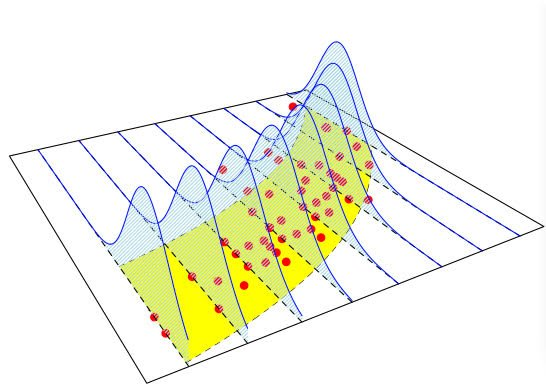

## Instruction

1.  *Open the Rmarkdown file of this assignment ([link](03_ayu_pod_submission.Rmd)) in Rstudio.*

2.  *Right under each question, insert a code chunk (you can use the hotkey Ctrl + Alt + I to add a code chunk) and code the solution for the question.*

3.  *Once you are done answering all the question, Knit the file (Use: Ctrl + Shift + K or Click to Knit -\> Knit to pdf or Word) to convert the Rmarkdown file into a pdf or word file to submit to Canvas.*

------------------------------------------------------------------------



## 1. Sample Codes

### GLM in R

-   To run a Generalized Linear Model (GLM) in R, we can use the functions `glm`. For example, in the [Term Life Insurance](https://bryantstats.github.io/SRM/ayu_pod/data/TermLife.csv) dataset, let's fit the following GLM

$$
log(FACE) = \beta_0 + \beta_1 \cdot EDUCATION + \beta_2 \cdot INCOME
$$

In the above model, the link function of the GLM is `log` and the distribution of the response variable is assumed to be Gaussian (Normal Distribution). The codes are as follows.


::: {.cell}

```{.r .cell-code}
# import library for read_csv
library(tidyverse)

# read the data
d = read_csv("https://bryantstats.github.io/SRM/ayu_pod/data/TermLife.csv")

# Filter out those with zero FACE values
d = d[d$FACE>0,] 

# Train the glm
model = glm(FACE ~ EDUCATION + INCOME, 
            data = d, 
            family = gaussian(link = 'log'))

# Report model summary
summary(model)
```
:::


-   If we want the `identity` link we could just use


::: {.cell}

```{.r .cell-code}
# Train
model = glm(FACE ~ EDUCATION + INCOME, 
            data = d, 
            family = gaussian(link = 'identity'))
# Report model summary
summary(model)
```
:::


-   Notice that this is the same as the `lm` function for multiple linear models.


::: {.cell}

```{.r .cell-code}
# Train
model = lm(FACE ~ EDUCATION + INCOME, 
            data = d)
# Report model summary
summary(model)
```
:::


-   What about other GLMs models? Below are some examples for the argument `family` in the `glm` function


::: {.cell}

```{.r .cell-code}
binomial(link = "logit")
gaussian(link = "identity")
Gamma(link = "inverse")
inverse.gaussian(link = "1/mu^2")
poisson(link = "log")
quasi(link = "identity", variance = "constant")
quasibinomial(link = "logit")
quasipoisson(link = "log")
```
:::


### Logistic Regression

-   Logistic regrssion is a special case of GLM with binary response. To run logistic regression, we just need to set `family = binomial(link = "logit")` in the `glm` function. Let's create a binary variable from the `FACE` variable then regress it on `EDUCATION` and `INCOME`. We define `FACE2` as follows.

    -   `FACE2 = 1` if `FACE` is greater than its median
    -   `FACE2 = 0` otherwise

The variable `FACE2` is created as follows.


::: {.cell}

```{.r .cell-code}
# calculate the median
face_median = median(d$FACE)

# create FACE2
d$FACE2 = ifelse(d$FACE > face_median, 1, 0)
```
:::


-   Now that `FACE2` is binary, we can train a logistic regression with `FACE2` being a response.


::: {.cell}

```{.r .cell-code}
# Train
model = lm(FACE2 ~ EDUCATION + INCOME, 
            data = d,
            family = binomial(link = "logit"))
# Report model summary
summary(model)
```
:::


#### Prediction and Accuracy

-   Making prediction is similar to `lm`. For example, let's predict the probability of a customer claiming morethan 150,000 (the median of `FACE`) for a customer with 12 years of education and income of 100000.


::: {.cell}

```{.r .cell-code}
predicted_prob = predict(model, list(EDUCATION = 12, INCOME = 100000), 
        type = 'response')
predicted_prob
```
:::


-   To make a categorical prediction (predict 0 or 1), we can convert the probabilities to the category. If the predicted probability is less than 0.5, we classify it as 0 and 1 otherwise. The code goes as follows.


::: {.cell}

```{.r .cell-code}
predicted_class = ifelse(predicted_prob>=.5, 1, 0)
predicted_class
```
:::


-   For classification problems (regression with categorical response) we can also compute the accuracy of the model by using the model to make prediction on the training data and report the percentage of the accurate predictions. The (training) accuracy of this model is:


::: {.cell}

```{.r .cell-code}
# Make predictions on the training data
predicted_value = ifelse(predict(model, d , type = 'response')>=.5, 1, 0)

# define the true values of the response
true_value = d$FACE2

# the percentage of accurate prediction
mean(predicted_value==true_value)
```
:::


### Poission Regression

-   Poisson Regression is another popular special case of GLM. The response in Poisson regression is a counting number (0, 1, 2,...). To demonstrate Poisson regression, we will bring in a new dataset.

[Dataset](https://bryantstats.github.io/SRM/ayu_pod/data/poisson_sim2.csv)

In this data, we will use the `num_awards` (the number of awards earned by students at a high school) as the response. The predictors are `math`, students' scores on their math final exam, and `prog`, the type of program in which the students were enrolled.


::: {.cell}

```{.r .cell-code}
d = read_csv('https://bryantstats.github.io/SRM/ayu_pod/data/poisson_sim2.csv')

model = glm(num_awards ~ prog + math, 
            data = d,
            family = poisson(link = "log"))
summary(model)
```
:::


-   Now, let's predict the number of award of a student scoring 70 for `math` and enrolling `Vocational` program


::: {.cell}

```{.r .cell-code}
predict(model, list(math = 70, prog = "Vocational"), type = 'response')
```
:::


-   We can calculate the p-value of the goodness of fit test for this model as follows.


::: {.cell}

```{.r .cell-code}
# Goodness-of-fit test
gof.pvalue = 1 - pchisq(model$deviance, model$df.residual)
gof.pvalue
```
:::


We observe that with this large p-value, the model does not fit the data well.

## 2. Questions

1.  Run the all codes in the Section 1 and show all the results

2.  We will use the [Wisconsin Hospital Data](https://bryantstats.github.io/SRM/ayu_pod/data/frees/HospitalCosts.csv) again for this question.

-   Train a GLM with the response being the total charge, `TOTCHG`. The response distribution is Gaussian (Normal) and the link function is `identity`. Give the model summary. Make a prediction with the model.

-   Train a GLM with the response being the total charge, `TOTCHG`. The response distribution is Gaussian (Normal) and the link function is `log`. Give the model summary. Make a prediction with the model.

3.  Create a binary variable from `TOTCHG` and train a logistic regression with this newly created variable being the response. Give the model summary. Make a prediction with the model. Calculate the training accuracy of the model.

4.  Find a dataset that has a counting variable to train a Poisson regression on. Train a Poisson regression with the data. Give the model summary. Make a prediction with the model. Report the p-value of the Goodness of fit test for the model.

