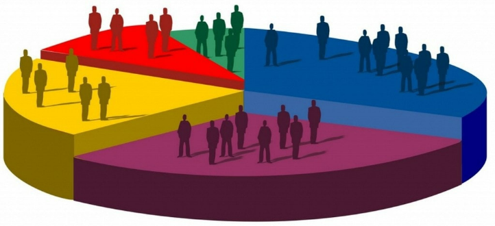
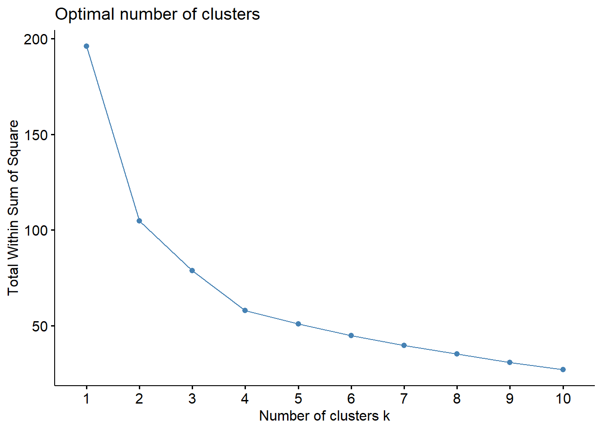
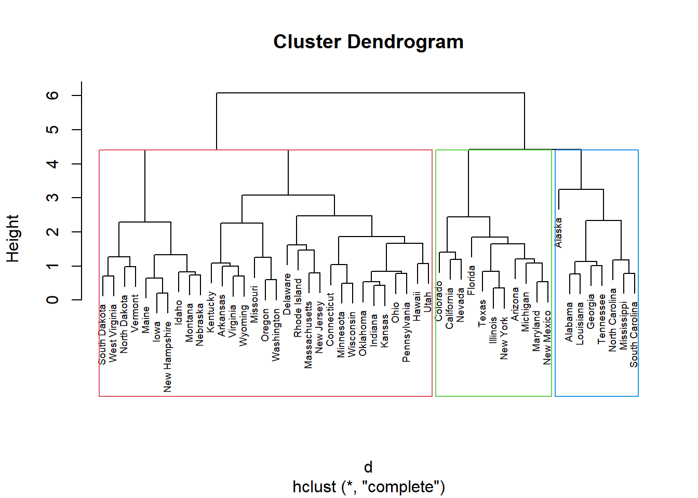
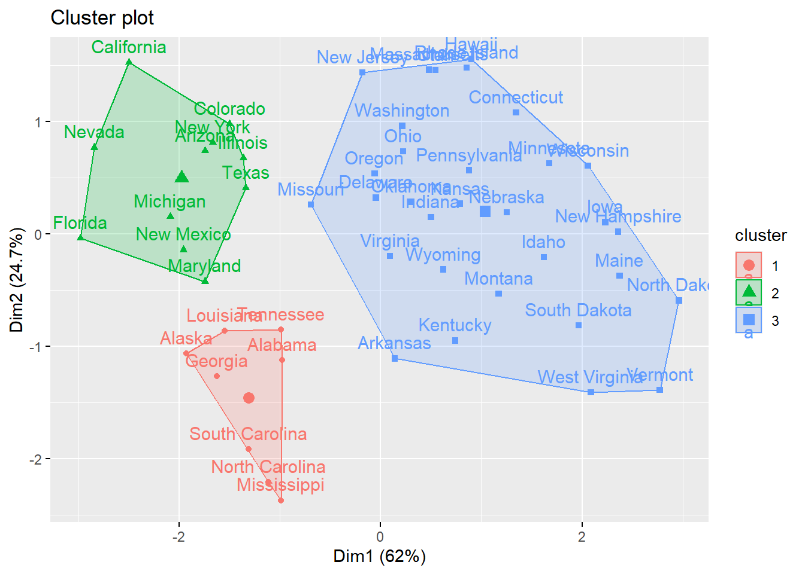
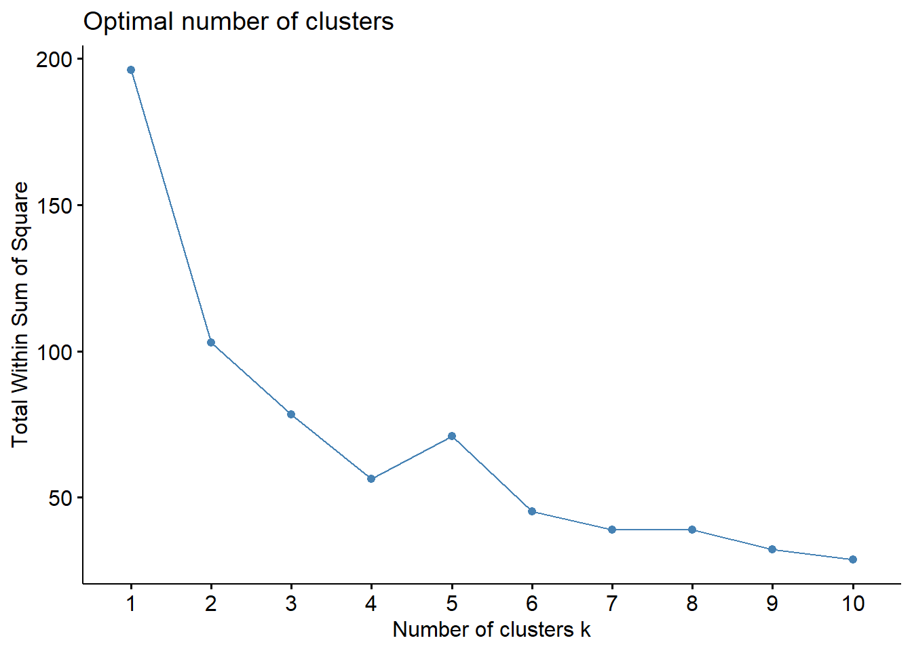
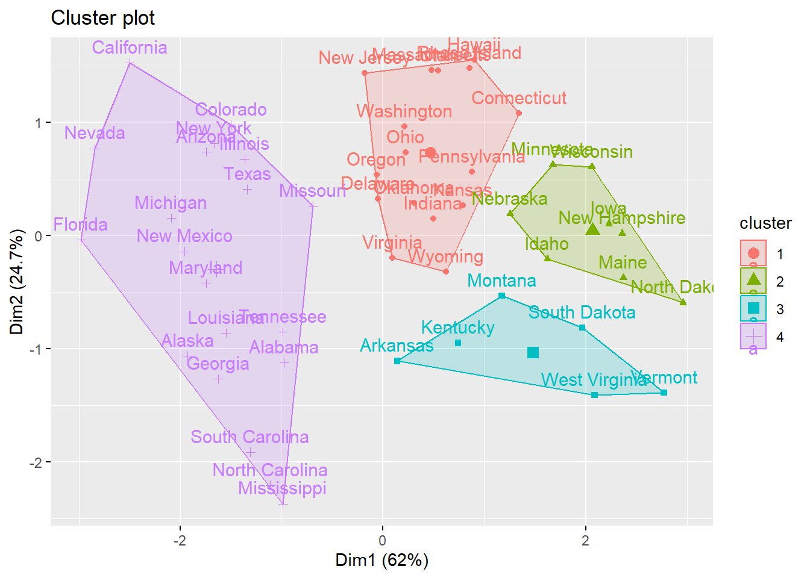

### Instruction

1.  *Open the Rmarkdown file of this assignment ([link](08_ayu_pod_submission.Rmd)) in Rstudio.*

2.  *Right under each question, insert a code chunk (you can use the hotkey Ctrl + Alt + I to add a code chunk) and code the solution for the question.*

3.  *Once you are done answering all the question, Knit the file (Use: Ctrl + Shift + K or Click to Knit -\> Knit to pdf or Word) to convert the Rmarkdown file into a pdf or word file to submit to Canvas.*

------------------------------------------------------------------------



(Source: kaggle.com)

## Hierarchical Clustering

We study the dataet `USArests`, which comes with R. This data set contains statistics, in arrests per 100,000 residents for assault, murder, and rape in each of the 50 US states in 1973. Also given is the percent of the population living in urban areas. A row in the dataset presents a state. 

We will use the package `factoextra`.  Use the below code to install the package.


::: {.cell}

```{.r .cell-code}
install.packages('factoextra')
```
:::


For a small dataset, we can actually visual the distances between all the data point using the distance matrix. 


::: {.cell}

```{.r .cell-code}
library(tidyverse)
library(factoextra)

df <- USArrests

# remove missing values
df <- na.omit(df)

# scale the data for clustering
df <- scale(df)

distance <- get_dist(df)
fviz_dist(distance, gradient = list(low = "#00AFBB", mid = "white", high = "#FC4E07"))
```

::: {.cell-output-display}
{width=672}
:::
:::

From the heatmap of the distance matrix, we have an idea of which observations are close (green color) or far away (orange color) from each other. 

Let use the Hierarchical clustering method to break down the states in groups. We use the following codes. Notice that we use the function `hclust` (also comes with R) for Hierarchical Clustering. 


::: {.cell}

```{.r .cell-code}
# Dissimilarity matrix
d <- dist(df, method = "euclidean")

# Hierarchical clustering using Complete Linkage
# Method could be single, average...

hi_clustering <- hclust(d, method = "complete" )

# Plot the obtained dendrogram
plot(hi_clustering)
```

::: {.cell-output-display}
{width=672}
:::
:::


### Decide the number of clusters

How many clusters should we decide to have?  First, let plot the total within sum of squares of the data for different numbers of clusters.  

Make the plot:


::: {.cell}

```{.r .cell-code}
fviz_nbclust(df, FUN = hcut, method = "wss")
```

::: {.cell-output-display}
{width=672}
:::
:::


We will use the `elbow` method to decide the number of cluster we should partition the data into. We will plot the total sum squares within clusters to determine how `spread out` the clusters are within themselves. 

If a cluster contains one point then the sum square within this cluster is zero. The more points a cluster has, the more likely it has larger sum squares. Thus, at the first step of hierarchical clustering where each point is a cluster, the total sum squares should be zero. At each step the total sum squares will be reduced.

We look for the `elbow` point of the graph, to identify the number of cluster. Looking at the graph, we can argue that the `elbow` point of this graph is at the number of cluster being 3. Thus, we decide that the number of clusters for the data is 3.

Let visualize these clusters in the dendogram. 


::: {.cell}

```{.r .cell-code}
# Assign clusters to the observations
sub_grp <- cutree(hi_clustering, k = 3)

USArrests = USArrests %>%
  mutate(cluster = sub_grp)

# Visualize the cluster
plot(hi_clustering, cex = 0.6)
rect.hclust(hi_clustering, k = 3, border = 2:5)
```

::: {.cell-output-display}
{width=672}
:::
:::

The `factoextra` also provide a way to visualize the clusters by the principal component analysis. Notice that the horizontal axis is the first principal component and the vertical axis is the second principal component analysis. We can see that the two principals break down the clusters quite clearly. 


::: {.cell}

```{.r .cell-code}
fviz_cluster(list(data = df, cluster = sub_grp))
```

::: {.cell-output-display}
{width=672}
:::
:::


### Practice 1

Working with the [Maill Customers](Mall_Customers2.csv) dataset.

- Read the dataset using `read_csv` and scale the dataset using `scale`. 

- Perform Hierarchical Clustering on the data

- Plot the total sum squares within clusters and use the `elbow` method to decide the number of clusters.

-   Visualize (with dendogram and the principal components) the clusters with the selected number of clusters.


::: {.cell}

:::


## K-means Clustering

For k-means method, we need to decide the number of cluster first before the computation process. Thus, we will plot the total within sum squares to use the `elbow` method to select $k$. 


::: {.cell}

```{.r .cell-code}
library(tidyverse)  # data manipulation
library(factoextra) # clustering algorithms & visualization

df <- USArrests
df <- na.omit(df)
df <- scale(df)
set.seed(123)
fviz_nbclust(df, kmeans, method = "wss")
```

::: {.cell-output-display}
{width=672}
:::
:::

From the graph, we can argue that the elbow is at $k=4$. 


::: {.cell}

```{.r .cell-code}
k <- kmeans(df, centers = 4)

fviz_cluster(k, data = df)
```

::: {.cell-output-display}
{width=672}
:::
:::


Let visualize the data with different numbers of clusters for k-means. 


::: {.cell}

```{.r .cell-code}
k2 <- kmeans(df, centers = 2)
k3 <- kmeans(df, centers = 3)
k4 <- kmeans(df, centers = 4)
k5 <- kmeans(df, centers = 5)

# plots to compare
p1 <- fviz_cluster(k2, geom = "point", data = df) + ggtitle("k = 2")
p2 <- fviz_cluster(k3, geom = "point",  data = df) + ggtitle("k = 3")
p3 <- fviz_cluster(k4, geom = "point",  data = df) + ggtitle("k = 4")
p4 <- fviz_cluster(k5, geom = "point",  data = df) + ggtitle("k = 5")

library(gridExtra)
grid.arrange(p1, p2, p3, p4, nrow = 2)
```

::: {.cell-output-display}
{width=672}
:::
:::


### Practice 2

Working with the [Maill Customers](Mall_Customers2.csv) dataset.

-   Plot the total sum squares within clusters and use the `elbow` method to decide the number of clusters.

-   Visualize the clusters with the selected number of clusters.

## Questions

1.  Run the all the above codes show all the results

2.  Do Practice 1 and 2.

