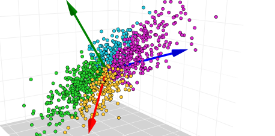
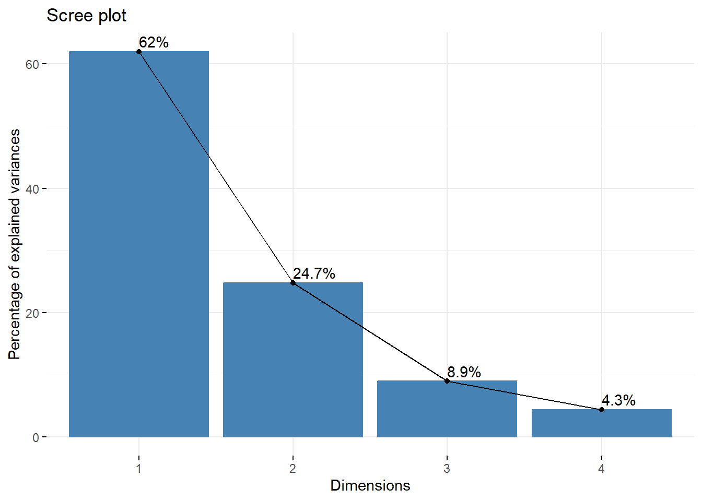
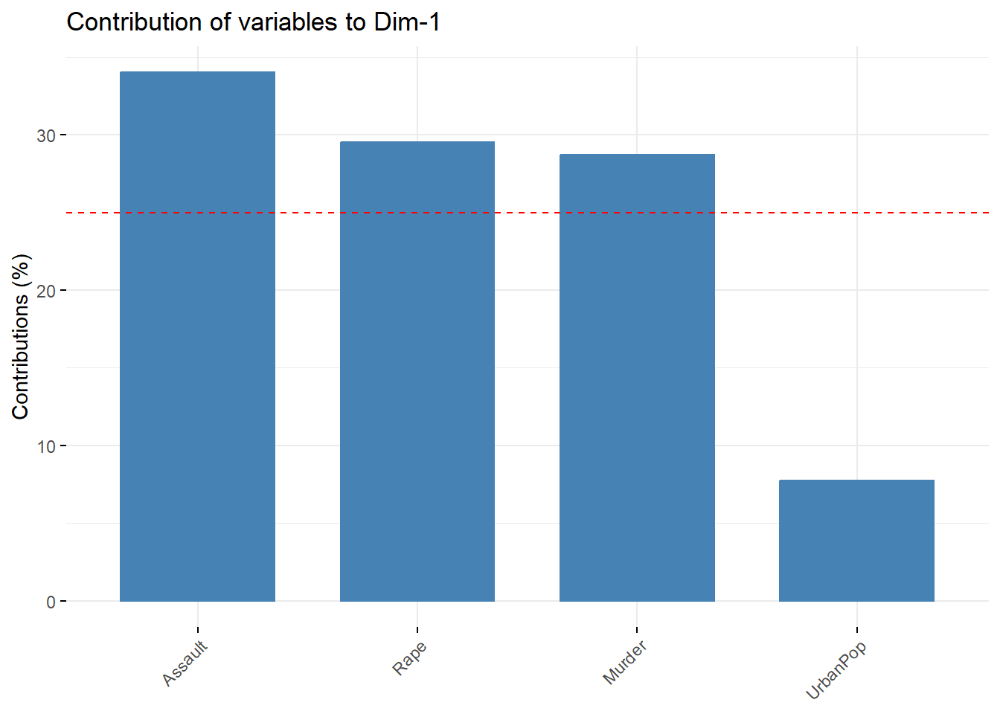
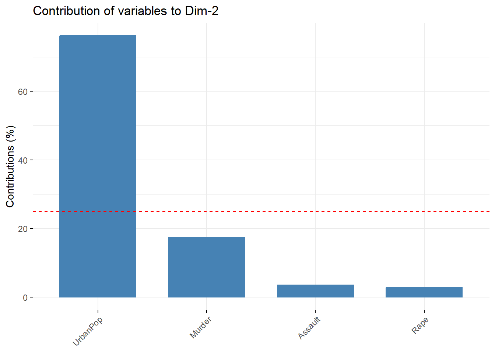
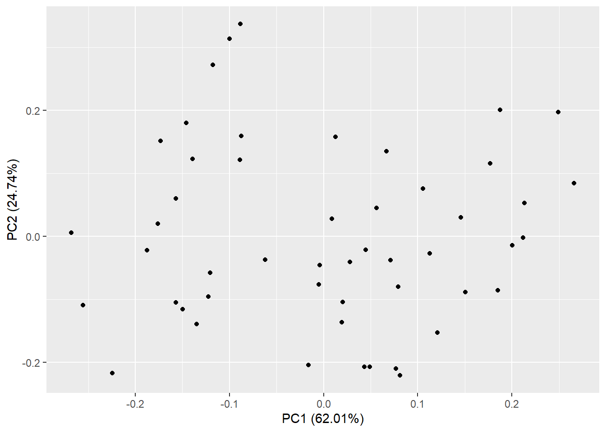

### Instruction

1.  *Open the Rmarkdown file of this assignment ([link](09_ayu_pod_submission.Rmd)) in Rstudio.*

2.  *Right under each question, insert a code chunk (you can use the hotkey Ctrl + Alt + I to add a code chunk) and code the solution for the question.*

3.  *Once you are done answering all the question, Knit the file (Use: Ctrl + Shift + K or Click to Knit -\> Knit to pdf or Word) to convert the Rmarkdown file into a pdf or word file to submit to Canvas.*

------------------------------------------------------------------------



*(Image: towardsdatascience)*

Principal components analysis transforms the original data to a new data containing the  principal components (PCs). Each PC is a linear combination the original columns (A linear a combination of $x$ and $y$ is a number times $x$ adding to a number times $y$, for example $2x+3y$). PCs are linear independent.  This means there will be no multilinearity when regression on the PCs. 

In this section, we will work with the `USArrests` dataset. We will apply the PCA to the data as follows.


::: {.cell}

```{.r .cell-code}
library(factoextra)
library(tidyverse)  
library(gridExtra)
data("USArrests")

df = USArrests
# The variable Species (index = 5) is removed
# before the PCA analysis
res.pca <- prcomp(df,  scale = TRUE)

# Default plot
fviz_eig(res.pca, addlabels = TRUE)
```

::: {.cell-output-display}
{width=672}
:::

```{.r .cell-code}
get_eig(res.pca)
```

::: {.cell-output .cell-output-stdout}
```
      eigenvalue variance.percent cumulative.variance.percent
Dim.1  2.4802416        62.006039                    62.00604
Dim.2  0.9897652        24.744129                    86.75017
Dim.3  0.3565632         8.914080                    95.66425
Dim.4  0.1734301         4.335752                   100.00000
```
:::
:::


We can see that the first two PCs captures about 86% variance of the original data. If we want to reduce the dimension of the original data from 4 to 2, we can just use this two PCs instead of the entire original data.  To put it in perspective, each variable in the original data set (after scaling) captures the same amount of the total variance, so each captures 25% the total variance. 

We can see the contribution of the original variables in the first two PCs. 


::: {.cell}

```{.r .cell-code}
# Contributions of variables to PC1
fviz_contrib(res.pca, choice = "var", axes = 1, top = 10)
```

::: {.cell-output-display}
{width=672}
:::

```{.r .cell-code}
# Contributions of variables to PC2
fviz_contrib(res.pca, choice = "var", axes = 2, top = 10)
```

::: {.cell-output-display}
{width=672}
:::
:::

::: {.cell}

```{.r .cell-code}
library(ggfortify)
autoplot(res.pca)
```

::: {.cell-output-display}
{width=672}
:::
:::


### Practice 1

Run the PCA for the `YieldCurve` data in the library `YieldCurve`.  Install the package using `install.packages("YieldCurve")` and use the following to import the data. 


::: {.cell}

```{.r .cell-code}
library(YieldCurve)
data(FedYieldCurve)
```
:::


Do the follows. 

- Plot the scree plot of the percentage of the total variances captured in the PCs. 

- How much variance is captured by the first two PCs? by the first PC?

- What are the contribution of the original variables in the first PC?

## Questions

1.  Run the all the above codes show all the results

2.  Do Practice 1


::: {.cell}

:::

::: {.cell}

:::

::: {.cell}

:::

::: {.cell}

:::

